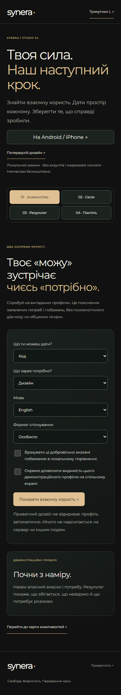
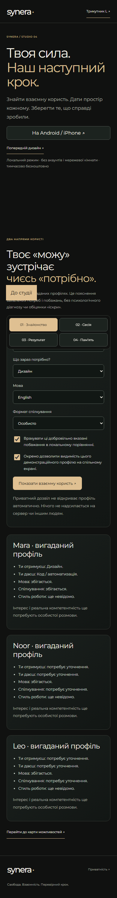
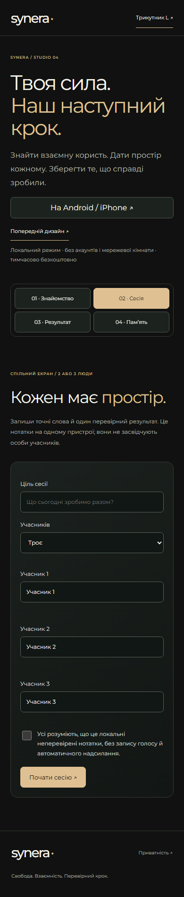
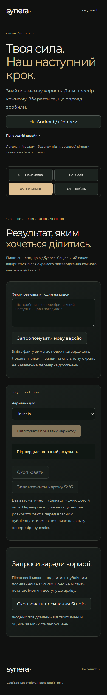
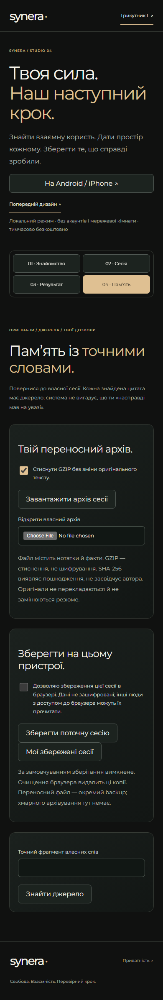
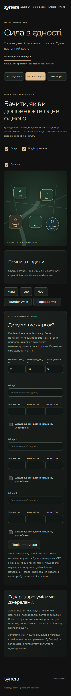

# Synera — два чесні проходи інтерфейсу

Дата: 2026-10-03. Стан: **підготовлено; запис ще не розпочато**. Atelier очікує окремого приймання вихідного коду та браузера.

## Формат і межа

Два портретні MP4, **390×844**, однаковий корисний маршрут і однакові демонстраційні дані. Це локальний Chromium на комп’ютері, без рамки вигаданого телефона. Дії виконує реальний браузер: натискання, поля, прокручування, зміна станів та завантаження архіву. Початкова форма, кожна ключова дія та її наслідок отримають окремий часовий запис.

«Чинний» — типовий вигляд прийнятої локальної збірки. «Atelier» — та сама збірка після видимого натискання перемикача. Пауза на результаті, спокійне прокручування й фактичні переходи UI; без прискорення, згенерованих екранів, голосового AI, музики або прихованого керування. Монтаж лише переводить вихідний WebM у H.264 MP4; оригінал збережено.

**У кадрі немає реальних зустрічей, незалежних учасників, бронювання, платежів чи постингу.** Нотатки та факт результату прямо містять слово «демонстрація». Локальні два підтвердження не засвідчують двох людей. Atlas залишається схемою вигаданих можливостей, без Google SDK та live-профілів.

## Візуальна розкадровка

Нижче — збережені реальні кадри поточного UI з аудиту. Це джерела задуму запису, а не вигадані кадри виконаних дій. Нові кадри пропозиції, відповідей і підтверджень будуть отримані під час проходу; тут вони не підмінені макетами.

### 1. Спокійний вхід → свій внесок і потреба

Відкрити Studio, дати прочитати основний намір. У другому відео відкрити «Вигляд», явно ввімкнути Atelier і повернутися до того самого потоку. Далі два окремі дозволи й «Показати взаємну користь».



### 2. Наслідок вибору

Показати існуючу демонстраційну Mara: хто що дає й отримує. Пауза має дати прочитати пояснення; це не запрошення людині.



### 3. Локальна сесія → пропозиція → відповіді

Натиснути «Сесія», заповнити ціль з міткою «Демо», вибрати двох, увести «Демо · автор» / «Демо · партнер», підтвердити обмеження локальних нотаток. Зберегти одну фактичну нотатку демонстрації. Запропонувати демонстраційне місце Zürich HB і натиснути дві локальні відповіді «Так». Не називати це реальною участю або бронюванням.



### 4. Результат → захищена соціальна чернетка

Спочатку показати недоступну кнопку чернетки. Запропонувати лише факт цього демонстраційного проходу. Після першого підтвердження кнопка лишається закритою; після другого відкривається. Підготувати й прочитати приватний текст. Нічого не публікувати і не копіювати в чужі сервіси.



### 5. Збережений оригінал і джерело

Натиснути «Пам’ять», реально завантажити GZIP-архів у власну папку цього запису, показати статистику. Знайти слово «Демонстрація» й точне посилання на джерело `session.notes`. Збереження в IndexedDB, імпорт файла та OS-діалог не імітувати.



### 6. Коротке завершення на Atlas

Перейти до Triangle реальним посиланням Studio й натиснути «Жива карта». Показати схему та картки, зберігши її реальні позначки демонстрації. Це додатковий огляд того самого режиму, без claim про Google-карту.



## Як запустити після приймання Atelier

Підготовка не запускає браузер і нічого не публікує:

```powershell
node tools/design-recording-20261003.mjs --prepare
```

`SOURCE_TO_ACCEPT.json` прив’язує конкретні UI-файли до SHA-256 і має статус `DRAFT_VARIANT_PENDING`. Після реального приймання Atelier головний чат звіряє ці хеші та записує **`LOCAL_UI_ACCEPTED`**. Сам факт створення шаблону не є прийманням.

```powershell
node tools/design-recording-20261003.mjs --capture --mode=both --accepted-source=artifacts/design-20261003/video/SOURCE_TO_ACCEPT.json
```

Запис відмовляється починатись без прийнятого manifest. До й після проходу звіряє джерела. Кожен запуск пише нову підпапку: вихідні WebM, MP4, часові дії, реальні viewport-кадри, локальні архіви та технічні квитанції. Наявні артефакти не перезаписує.

## Приймання

1. Браузер виконав маршрут без page errors і зовнішніх запитів; зріз source до/після збігається.
2. Обидва MP4 мають 390×844, без аудіодоріжки, пройшли ffprobe й повне декодування FFmpeg.
3. Відкрито й переглянуто кадри кожного ключового етапу, правильні стани кнопок і читабельний текст. Blank/loading або неправильний кадр не приймаються.
4. Порівняно однакові дії, факти й дозволи у двох режимах. Тривалість не оголошується до фактичного запису; відео не прискорюються.
5. Людський перегляд визначає, чи комфортно дивитися, чи досить пауз і чи переданий задум. Технічне PASS його не замінює.

Provider calls: 0; USD $0.00. Економію первинної підписки не виміряно.
