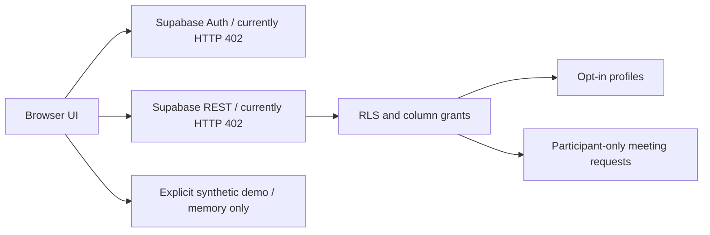
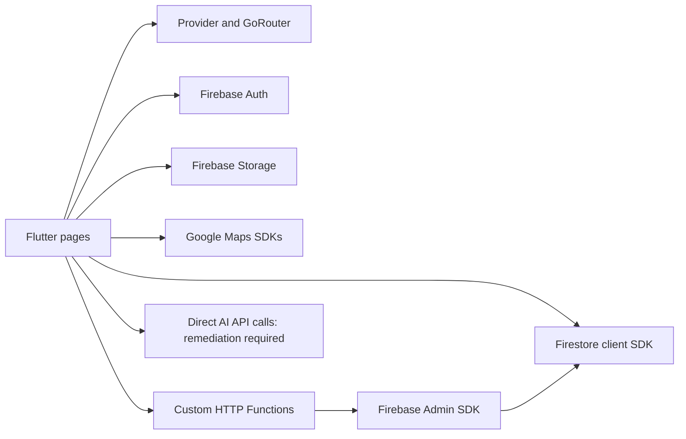

# Source architecture

## Current browser / Supabase implementation

The new browser implementation is in [`web_launch/`](../web_launch/README.md), alongside the original Flutter source. `app.mjs` renders user text through DOM textContent; `data.mjs` provides the synthetic store and the Supabase Auth/REST adapter. `config.mjs` validates public configuration and produces restrictive response headers. `server.mjs` serves an explicit allowlist locally; `build.mjs` produces the equivalent static deployment package.

The [schema](../supabase/schema.sql) is applied and [transactional access tests](../supabase/acceptance.sql) passed. Auth/REST availability is blocked at the provider gateway despite the working database-management connection. No service-role key or administrative API is exposed to the browser. No Firebase data was migrated. Email confirmation remains enabled; registration, real browser persistence, deletion and moderation still require acceptance.

## Local collaboration laboratory

The separate `/lab.html` page reuses the same server/build allowlist. `matching.mjs` is a pure deterministic baseline on explicitly projected fields; `economics.mjs` calculates editable assumptions. The lab has no Supabase or LLM connection and does not read existing member profiles. [Shared-mediator design and exact limits](meeting-gilbert/MEDIATOR.md) describe the implemented slice and the later authenticated journey.

## Legacy Flutter / Firebase architecture

Inspected on 2026-09-04 at `ba4e07567dc06139c336f9ad9262af88f31c5e7d`. This map describes code, not deployed infrastructure.

## Entry point and application roots

[`lib/main.dart`](../crystallised_in/lib/main.dart) initializes Firebase, creates `FFAppState`, wraps the app in Provider, and configures GoRouter. It declares English and Ukrainian locales. The displayed application title still uses an older product name.

[`lib/flutter_flow/nav/nav.dart`](../crystallised_in/lib/flutter_flow/nav/nav.dart) declares authentication, profile, map, diaries, recording, optimizer, mutual-benefit, and meeting routes. Only AboutMe and ProfilePhoto explicitly declare `requireAuth: true`; the route abstraction defaults to false. This needs journey testing and is not a backend access boundary.

`crystallised_in/android/lib/main.dart` is a separate Flutter counter sample. The actual product entry point is `crystallised_in/lib/main.dart`.

## Source locations

| Area | Location |
| --- | --- |
| Pages and reusable UI | [`lib/app_pages/`](../crystallised_in/lib/app_pages/), [`lib/components/`](../crystallised_in/lib/components/) |
| Auth adapters | [`lib/auth/firebase_auth/`](../crystallised_in/lib/auth/firebase_auth/) |
| Firestore models | [`lib/backend/schema/`](../crystallised_in/lib/backend/schema/) |
| HTTP and AI request definitions | [`lib/backend/api_requests/api_calls.dart`](../crystallised_in/lib/backend/api_requests/api_calls.dart) |
| Firebase web initialization | [`lib/backend/firebase/firebase_config.dart`](../crystallised_in/lib/backend/firebase/firebase_config.dart) |
| Custom map and actions | [`lib/custom_code/`](../crystallised_in/lib/custom_code/) |
| Server handlers and rules | [`firebase/`](../crystallised_in/firebase/) |

Schema names include `users`, user subcollections for locations, exchanges, photos, diaries, metrics, ratings, and custom markers, plus `friendships` and `meetings`. The existing name `optiomizers` is misspelled in code/rules; do not silently rename a collection while documenting it.

## HTTP interfaces requiring remediation

| Export | Source behavior | Required boundary |
| --- | --- | --- |
| `displayUserInfoOnGMarkerTap` | Reads user records and related location/exchange information | Authenticated caller; public fields and opt-in locations only |
| `cloudFunctionDiarieAImatch` | Reads one requested user or multiple users with diary content | Verified caller and explicit authorization; no unrestricted diary enumeration |
| `funcForDiariesForLoggedUser2` | Accepts `userId` from body/query and loads that user's diaries | Derive identity from verified token; enforce ownership |

All three local probes reached the Admin database boundary with an anonymous request. The probe stops at an in-memory stub and does not establish whether deployed IAM currently allows these requests. Admin SDK access requires its own authorization; changing Firestore client rules alone does not fix these handlers. [Firebase rules documentation](https://firebase.google.com/docs/firestore/security/rules-conditions).

The generated `functions/index.js` exports `onUserDeleted`, which deletes the parent user document. Recursive subcollection and Storage cleanup is not implemented there and requires a separate tested deletion flow.

## Legacy remediation still required

The browser launch uses Supabase instead of these legacy Functions. Seven embedded AI-key literals were removed locally, and `ApiManager.makeApiCall` now returns an explicit failure before direct OpenAI requests. That Dart guard has not been compiled on this host. Any future AI integration needs verified identity, consent, restricted inputs, rate limits and a managed server secret. Private diary access must be designed before matching uses its content.
