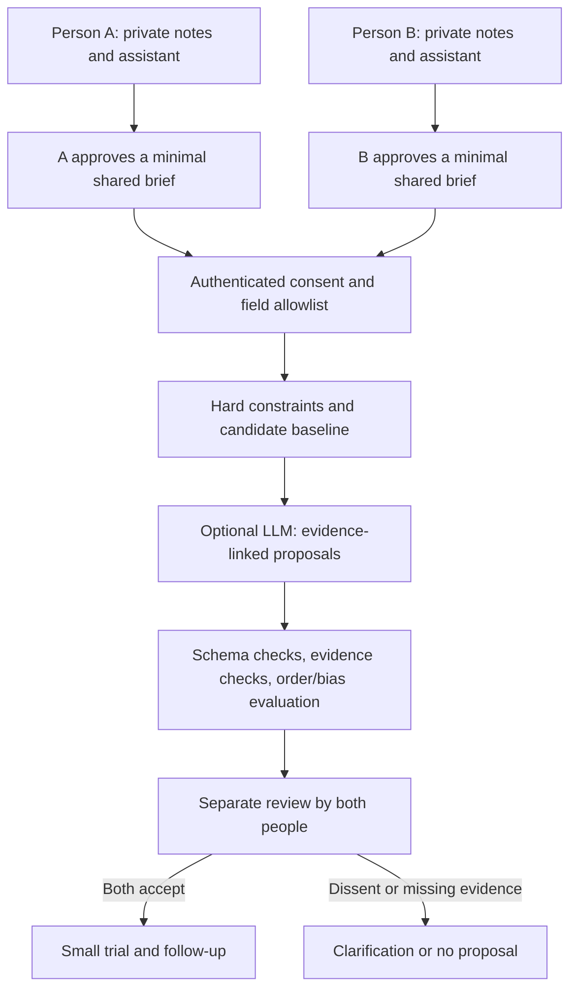

# Synera collaboration mediator: bounded prototype and next implementation

## Current executable slice

Open `/lab.html` on the existing local server. No package installation, database mutation, external AI request, analytics, geolocation permission or payment occurs in this page. Inputs remain in memory. The standalone laboratory does not fetch the Supabase config or attempt authentication. It is served by the existing public allowlist.

Implemented in [matching.mjs](../../web_launch/matching.mjs):

1. Explicit structured projection: capability tags, weighted needs, city, language, availability, acceptable collaboration modes, confidentiality, comparison and geographic consent. Name, email, private diary, payment tier, founder role and arbitrary instructions are excluded.
2. Consent before returning comparison content. Missing, stale (>30 days), future-dated or invalid mandatory data cause an abstention. A person is not matched with themselves.
3. Hard filters: shared language, mode, overlapping availability, the stricter travel limit unless both accept remote work, and confidentiality compatibility. A conflict yields no suggested plan.
4. Per-direction need coverage with source field references. The displayed baseline score is the **minimum** of the two weighted percentages. This is a declared product rule, not calibrated probability, person quality, fairness measurement or truth detection.
5. A proposal exists only if both directions have some coverage. It states unmet needs and a small meeting agenda. A competence claim remains self-reported until independently checked.
6. Simulation of two-sided approval; modifying input clears the result and simulated approvals. These controls in one browser are not identity verification or production authorization.
7. Separate geographic opt-in for a small fictional nearby list. Distances use approximate city centres and Haversine; they are not routes, travel time or exact member locations. No basemap or geocoder is connected.

The taxonomy has seven business capabilities and two cooperation modes. It is intentionally a measurable baseline: it cannot infer nuanced compatibility from arbitrary prose, negotiate prices, optimize groups, or decide a disagreement. A score of 75% in the fictional example indicates declared need coverage only. It does **not** establish a 75% chance of business success.

## What “neutral” can mean here

Procedural commitments: same schema, disclosed criteria, no preference for payer/founder, equal opportunity to correct evidence, symmetric evaluation, explicit uncertainty and a recorded right to disagree. These are testable properties of parts of the system. They do not prove complete neutrality: taxonomy choice, eligibility criteria, weights, who joins the pool and whose evidence is available can all embed bias.

[LLM judging research](https://arxiv.org/abs/2306.05685) motivates order/bias checks. [Reasoning-model research](https://arxiv.org/abs/2504.09946) shows that more reasoning alone is insufficient. [AI deliberation research](https://deepmind.google/research/publications/65220/) supports exploring iterative critique and common-ground drafts; its setting does not validate business arbitration.

An AI should not assign equity/ownership percentages, decide whose private recollection is true without evidence, make hiring/credit/legal decisions, or bind participants. The first shared tool should help formulate options and evidence gaps. It should sometimes conclude: “No mutually acceptable proposal from the available evidence.”

## Intended full journey — not yet deployed



There is one application/backend, not a new agent operating system. Reuse Supabase Auth and RLS; model calls would use the existing approved server adapter/control plane after configuration and acceptance. Provider secrets never enter browser code. The optional model has no tools for sending messages, accessing arbitrary profiles or changing state.

## Profile and consent boundaries for the next slice

| Zone | Allowed data | Who can read | Acceptance before real collection |
| --- | --- | --- | --- |
| Own workspace | Private notes, drafts and attachments | Owner only; processor only with explicit authorized scope | A/B/anonymous denial tests, export/deletion, storage rules |
| Discoverable business card | User-approved offer, need, approximate city and language | Authenticated allowed cohort; opt-in | Tenant/cohort + discoverability RLS, expiry, abuse controls |
| Shared case | Exact fields and claims approved for this case | Both participants only | Versioned consent; revocation before generation/intro |
| Contacts | Selected contact method | Both after explicit introduction acceptance | Participant and state checks on server; no client shortcut |
| Outcome | Occurred/not occurred, separately rated value, optional agreed next action | Participants; minimized operational aggregates | No raw private conversation in analytics |
| Billing | Customer/subscription IDs, entitlement state | Server; owner sees own permitted subset | Signed webhook, idempotency, ownership, expiry/refund tests |

Suggested pilot retention policy, to be agreed and implemented: needs expire for matching after 30 days unless reconfirmed; abandoned shared-case drafts deleted after 30 days; no audio recording by default; keep only agreed outcome metadata for evaluation. Account deletion must also address downstream processors/backups under a documented schedule. These are proposed limits, not current automated deletion guarantees.

Business profiles in the lab are **not** being saved to the production `profiles` table. A migration should follow the agreed schema and include RLS tests. Do not silently stuff structured profile JSON or journals into the public `offers` field.

## Future LLM contract

Input is a case-specific, approved projection. Pseudonymous A/B labels reduce identity cues but are not guaranteed anonymization: rare skills/city combinations can identify people. A user text field is untrusted case data, never an instruction. Server-side limits, validated identifiers, content bounds, cost caps and no arbitrary retrieval are required.

Example output shape (specification, not a model response):

```json
{
  "status": "needs_clarification | proposals | no_mutual_option",
  "agreed_facts": [{"claim_id": "c1", "source_ids": ["a-1", "b-2"]}],
  "unverified_claims": [{"claim_id": "c2", "party": "A", "source_ids": ["a-3"]}],
  "disagreements": [{"topic": "scope", "positions": {"A": "...", "B": "..."}}],
  "questions": [{"party": "A", "question": "...", "why_needed": "..."}],
  "proposals": [{"title": "...", "benefits": {"A": "...", "B": "..."}, "costs": {"A": "...", "B": "..."}, "source_ids": ["a-1", "b-2"], "unknowns": ["..."], "trial": {"action": "...", "success_check": "..."}}],
  "decision_authority": "participants_only"
}
```

The validator must reject unknown evidence IDs, omitted costs for either party, claims of binding authority and outputs inconsistent with hard constraints. The LLM must not turn a self-report into a verified fact or infer consent from a friendly message. Human review still checks meaning; structural validation is insufficient. Cross-family evaluation is a future budgeted activity, not a model run made in this task.

## Acceptance matrix

| Test | Baseline result / next gate |
| --- | --- |
| Swap A/B while preserving identities | Exact equal result on 64 deterministic combinations |
| Add founder/name/premium metadata or a long instruction | Cannot change matching result; fields absent from report |
| Revoke one comparison consent | No score, plan, profile content or report |
| No reciprocal coverage | Explicit no-mutual-value state |
| No shared language/dates/mode or incompatible confidentiality | Explicit incompatible state |
| Stale/invalid profile | Asks for information, no positive recommendation |
| Duplicate capability tags | Cannot inflate coverage |
| Geographic opt-out | Excluded from nearby list |
| One simulated approval | No simulated introduction authorization |
| Change profile after simulated approval | Browser clears old result and approvals |
| Actual multi-user shared case and revocation | NOT IMPLEMENTED; requires authenticated server tests |
| Semantic LLM quality, evidence fidelity, adversarial case texts | NOT RUN; no model connected |
| Both users judge relevance/fair treatment and then collaborate | NOT RUN; requires pilot participants |
| Groups of three or more | NOT IMPLEMENTED; start after two-person journey is useful |

## Priority after the meeting

First: recover and accept real sign-in; minimum privacy/deletion/moderation; current business card with approved fields; meeting outcome capture. Then compare the tested baseline against consented human pair judgments. Add semantic extraction and proposal generation only where failures show it helps, with explicit uncertainty and field-by-field user confirmation. Add a true map after there is enough opted-in density to make it useful. Billing follows actual seller setup and test-mode acceptance.

This order is intended to improve decision clarity and preserve reusable code. It does not declare the full product or AI mediator complete.
