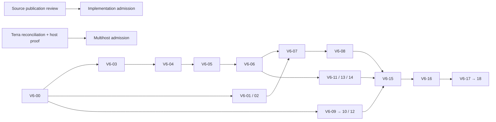

# V6 → multihost R1: scope, ownership, DAG

Original V5/V6 bytes не змінюються; `SOURCE_MANIFEST.json` містить original hashes. `V6_TASKS.json` зберігає 19 задач, первинні depends_on/acceptance/owner_role/owned_paths і явний `r1_overrides` для виправлень. Для майбутнього виконання **effective owned paths = override, якщо він є; інакше original owned_paths**. Draft-only задачі володіють тільки своїм `draft_output`; їх source_paths read-only. Це planning data, dispatch=false.

## Задачі та приймання

| ID | Результат | Owner / files | Залежить від / доказ |
|---|---|---|---|
| V6-00 | Baseline + RED approval boundary | baseline, isolated probe | локальний сучасний source; control PASS + defect FAIL, не import failure |
| V6-01 | DE-CH словник | product, тільки V6-01 draft | 00; journey/error/consent coverage, human language review pending |
| V6-02 | 5-screen design proposal | design, тільки V6-02 draft | 00; state matrix, доступність, human visual acceptance pending |
| V6-03 | Per-party contract | data, тільки V6-03 draft | 00; [конкретний контракт](V6-03-CONTRACT.uk.md), server principal, version CAS |
| V6-04 | Store fix + semantic RED→GREEN | data, profile-store + new case-store regression + real-pilot tests | 03; own approval persisted, foreign/stale rejected |
| V6-05 | Worker/auth/schema compatibility | data, worker/tests + canonical Supabase proposals/tests + generator | 04; generated Neon bytes checked; no manual generated edit |
| V6-06 | UI persisted readback | integrator, app + mobile-pilot tests | 05; offline/409/peer approval states in two synthetic sessions |
| V6-07 | Locale integration | integrator, app/index/data | 01,06; draft/approvals unchanged on language switch |
| V6-08 | Design integration | integrator, style/index | 02,07; keyboard, zoom, focus, mobile screenshots + human review |
| V6-09 | Freshness | math, matching/tests | 00; monotonic half-life, invalid dates explicit, no consent effect |
| V6-10 | Proposal capacity | math, matching/tests | 09; small general graph exhaustive oracle, eligible edges only |
| V6-11 | Honest funnel | analytics, economics/tests | 06; fixed denominator, missing feedback, dedup, synthetic separation |
| V6-12 | Availability intersection | calendar, calendar + new calendar regression | 00; UTC intervals, explicit DST ambiguity, no booking |
| V6-13 | Import/portability hardening | privacy, existing import/transfer/portability modules and tests | 06; injection inert, no network before permission, export/revoke semantics |
| V6-14 | Recipient acceptance | domain, business-case/tests | 06; sender cannot accept for recipient; material invalidates approvals |
| V6-15 | Integrated local acceptance | acceptance, mobile-pilot tests/build | 08,10,11,12,13,14; suite + offline build + actual browser + mutations |
| V6-16 | Disposable DB/RLS acceptance | acceptance, report-only; generated SQL read-only | 05,15 + exact DB authority; two identities + outsider + races/restore |
| V6-17 | Two-person pilot | operator, report-only | 16 + privacy/legal review + release approval + consent; actual people |
| V6-18 | Learning cohort | operator, report-only | 17; elapsed 14 days, honest denominators and manual baseline |

Source paths вище відносні до **сучасного source**, не старої публічної main. Точні allowed files — у JSON. New test files дозволені як план майбутньої зміни, а не твердження про їх наявність. V6-16 виявлений schema defect повертає repair proposal до canonical source owner; він не редагує generated SQL на місці.

## DAG і reviewer barriers

Mermaid стискає гілки для читання; точні залежності — у V6_TASKS. `X` є зовнішньою передумовою всіх public-base implementation cards; `H` потрібна лише для multihost mutation. V6-03 можна уточнювати локально без продуктового редагування і без H.

Reviewer barrier після V6-03 до будь-якого store edit; після V6-04 для approval-change acceptance; після V6-05 для auth/schema acceptance; після V6-06 для UI readback. Окремі barriers після 07/08, 09/10, 11/12/13 і 14; V6-15 інтегрує їх evidence. Це acceptance clauses на чинних вузлах, не нові runtime tasks і не збільшення 19 до довільної кількості. Reviewer не автор патча. Відсутній незалежний reviewer → HOLD acceptance.

Базова спільно-файлова послідовність: 04→05→06→07→08; matching 09→10; app 06→07; mobile-pilot 06→15. V6-18 читає economics, не володіє його mutation. Незалежні read-only дослідження можна робити паралельно; інтегратор перед кожною хвилею перевіряє normalized paths, resources і review backlog.

## Джерельні виправлення

1. V6-04: `real-pilot.test.mjs` не містить case-state persistence regression. Існуючий зовнішній RED probe має бути перенесений/адаптований у `web_launch/case-store.test.mjs`, з позитивним own-party roundtrip і foreign/stale negatives. Послаблення assertion, skip або catch-all success не приймаються.
2. V6-05: `neon/generate-schema.mjs` генерує case-state SQL із canonical `supabase/case-state*.sql`. Власник змінює canonical source/generator, перевіряє derived bytes. V6-16 використовує ці outputs read-only.
3. V6-12: календарна логіка потребує task-shaped `calendar.test.mjs`, не лише наявності implementation file.
4. Старі paid fields історичні; R1 не передає їх як authority. Preserved source hashes і original acceptance не змінюються.

## Один prompt для наступного виконавця

**Step ID:** V6-03. **Objective:** звірити proposed per-party contract із актуальним store, worker, canonical SQL і generated mapping; закрити unresolved API mapping лише в документації. **Allowed writes:** V6-03 draft. **Read-only inputs:** source hashes із manifest, profile-store, worker, canonical case-state SQL, generator, existing RED probe. **Must preserve:** own-party approval, material-version binding, revoke/expiry, pair contract, старі deployments, оригінальні V6 artifacts. **Do not:** product edit, SQL execution, new router/queue, hosted private context, false acceptance. **Stop:** hash drift, absent source, incompatible auth mapping. **Validation:** endpoint/operation mapping table, request/response/error examples, доказ атомарної version check або явний HOLD. **Marker:** V6_03_CONTRACT_REVIEWED; його може видати лише незалежний reviewer після перевірки. **Rollback:** відхилити тільки draft. **Return:** changed paths/hash, evidence, unknowns, next blocker. Не переходити автоматично до V6-04.
